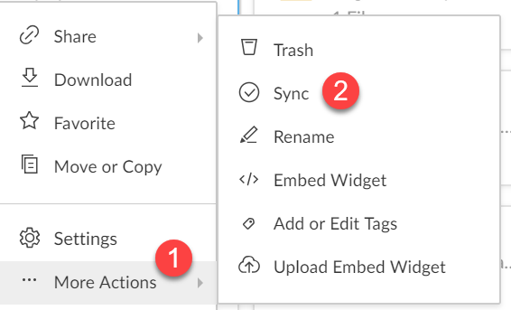

```{r setup, include=FALSE}
knitr::opts_chunk$set(echo = TRUE)
library(rmarkdown)
```


##Packages Used
```{r, echo = TRUE, message = FALSE, warning = FALSE}
library(taskscheduleR)
library(boxr)
```

Data prep seems to be a common task required for anything involving data, something even as simple as renaming columns. Let's say every Monday morning you have to pull a report and manipulate it, why not automate this so you don't have to lose 20 minutes every Monday? I've been thinking recently how to automate the reports being pulled and then using R to prep this data and then following on from this, have data vizualisation auto refresh the data.

##Overview of the process

1. **BOX folder online**
* Create a folder and enable **emails send files to folder**
* Note down the email
* Enable **SYNC** (syncing the file to the BOX sync folder on the desktop)
\
\
2. **Reporting system**
* Schedule a report to be sent every hour (can change the time between report sends) to be sent to the email of the **BOX folder**
\
\
3. **BOX sync**
* Make sure the file/folder is syncing to the box sync folder
\
\
4. **R script**
* Pull the file from the BOX Sync folder
* Prep the data to your heart's content
* Setup automatic running of the script using `taskscheduleR`


That's a brief overview, let's get into it.
<p>
###BOX folder online
Starting online at the BOX folder. Create a folder and jump into its **settings**. From here tick **Allow uploads to this folder via email**. Note down this address and save it for the next step.

You may want to select **Overwrite files with the same name when uploading by email or widget** to get the most recent report (assuming the reports have the same name). This may not be necessary if you want to e.g. union new files per quarter.


\
Now head back to the folder and select the three ... then **more actions** and finally **SYNC**

```{r,echo = FALSE}

```
<p>
###Reporting system
Your reporting system will vary but most will probably have some form of scheduling capabilities. I've found most follow the process of...

1. Create the report
2. Select "schedule"
3. Choose file type of csv/xlsx
4. Input the **BOX email address** as the email address to sent it to
5. Input how often you want it to refresh

###BOX Sync
If you wish to access your online BOX folder skip to option 3 below.

Otherwise look in your desktop BOX sync folder and your file should be there! This will now be updating when your scheduled report hits the online BOX folder. 
<p>
###R script

I've found that the deal breaker with this is the package `boxr`. This allows for you to access your BOX sync folder(either online/desktop) BUT there are some required steps to access it. I've found 3 options, there could be more...

1. Straight away access the desktop folder, no extra steps
2. If you're using a **SSO (Single Sign On)** the first time you try to read a file from this directory you may be prompted to log onto your account. Do it once, you shouldn't be prompted again.
3. You may need to do some extra steps but you can access your **online BOX folder** no need to sync it to the desktop. I won't go into this but here is a [guide](https://cran.r-project.org/web/packages/boxr/vignettes/boxr.html)\

Pick which ever one suits your situation. If you're working at a company that doesn't grant access to the bottom solution because they don't allow for BOX app creation then hopefully option 1 or 2 can help you.

###Example of a script
The script follows a similar structure and then the prep/output is all that needs to be altered.

```{r, echo = TRUE, eval = FALSE}
library(boxr)           # Access BOX
library(taskscheduleR)  # Automate the script
library(tidyverse)      # Data prep

data <- read.csv("location of BOX sync folder + file name")

###DO DATA PREP

###MAYBE THROW A DATA VIZ IN HERE AND EMAIL IT TO SOMEONE?

output <- write.csv("location of output")
```

Hopefully this describes the idea/concept and can be tweaked to you're needs. Once this is done go into **Addins** in RStudio and fill out the details and make your tweaks and setup your refresh schedule.


Now that this is done you're good to go! Create as many auto refreshes as you like. As long as your desktop is online at the time of the refresh the script will auto run itself.

###Benefits
<p>
* Set and forget
* Manipulate exactly what you want
* Process large datasets quicker (especially quicker than Excel)
* Dump the file exactly where you want it

##Summary
This isn't the most ideal solution to pulling reports but it is a good work around. I like that R has way more capabilities in the data prep world compared to Excel and that R has a greater processing power. You don't necessarily have to use this for data prep only you could create vizs and then email them to people along with the figures.